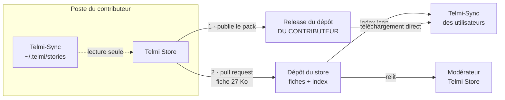
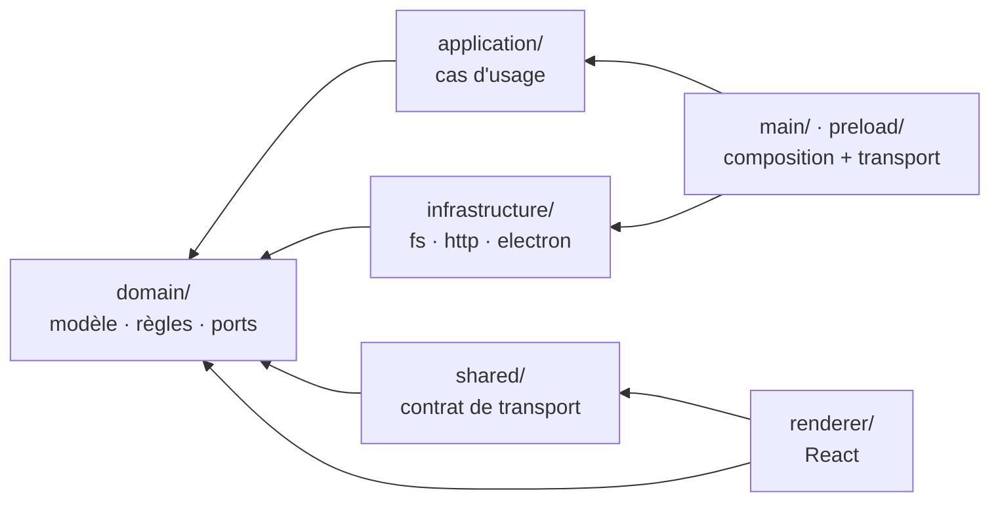
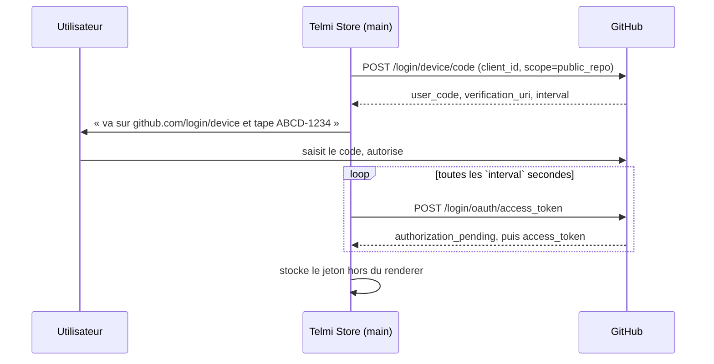

# Architecture cible

Ce document décrit où l'on va, pas seulement ce qui existe. Ce qui est déjà écrit est
signalé par ✅, le reste est à faire.

## 1. Vue d'ensemble

Le principe tient en une phrase : **l'application est le client git que personne ne voit.**



Le trait important est celui qui **manque** : aucune flèche ne fait passer d'octet de pack
par le dépôt du store. Il ne porte que des liens.

## 2. Les couches ✅

Une seule règle, et tout en découle : **les dépendances pointent vers l'intérieur.**



| Couche | Contient | Peut importer |
| --- | --- | --- |
| `domain/` | le vocabulaire, les règles, les *ports* | **rien** |
| `application/` | les cas d'usage | `domain` |
| `shared/` | le contrat de transport IPC | `domain` |
| `infrastructure/` | les adaptateurs : `fs`, `http`, Electron | `domain` |
| `main/`, `preload/` | la composition et le transport | tout |
| `renderer/` | React, et la présentation | `domain`, `shared` |

### Ce que ça règle concrètement

Trois couplages précis ont disparu :

1. **Les règles métier ne sont plus dans un composant.** « Cette histoire est-elle
   publiable » se répond dans `domain/rules/submission.ts`, testable sans monter un
   composant — et l'écran de modération appliquera la même lecture à ce qu'il reçoit.
2. **Le français a quitté l'infrastructure.** Le domaine renvoie ses échecs en
   *données* (`AppError`, une union discriminée) ; un seul fichier,
   `renderer/presentation/messages.ts`, en fait des phrases. Tous les messages sont
   auditables d'un coup d'œil, et un `switch` exhaustif transforme un cas oublié en
   erreur de compilation plutôt qu'en écran blanc.
3. **Les adaptateurs sont interchangeables.** `httpFetcher` est testé contre un coffre
   en mémoire : l'adaptateur sous test est celui du réseau, rien d'autre n'a besoin
   d'être réel.

### Les ports

`domain/ports.ts` déclare ce dont l'application a besoin du monde extérieur, en
interfaces qu'elle possède :

| Port | Ce qu'il promet | Adaptateur |
| --- | --- | --- |
| `StoryLibrary` | lister les histoires installées | `fsStoryLibrary` |
| `FileVault` | garder les fichiers choisis, résoudre un identifiant | `fsFileVault` |
| `FilePicker` | demander des fichiers à l'utilisateur | `electronFilePicker` |
| `Fetcher` | rapatrier un fichier distant dans le coffre | `httpFetcher` |

`main/index.ts` est la **racine de composition** : le seul endroit où l'abstrait
rencontre le concret, et le seul à changer quand une implémentation change.

### Pas de cérémonie

Ce qui a été délibérément évité : pas de classe par cas d'usage — de simples fonctions
qui reçoivent leurs ports en premier argument ; pas de conteneur d'injection ; pas de
*mapper* entre deux formes identiques. Le domaine reste du TypeScript ordinaire.

### La règle est vérifiée, pas espérée ✅

Une convention que personne ne contrôle se dégrade en un mois.
`tests/architecture.test.ts` lit les imports de chaque fichier et échoue sur une
dépendance interdite : `domain` qui importerait Node, Electron ou React ; `renderer` qui
atteindrait un adaptateur ; une fabrique appelée ailleurs que dans la racine de
composition. Le sens des flèches est donc une erreur de build, pas un sujet de revue.

## 3. Les trois processus

| Processus | Rôle | A accès à |
| --- | --- | --- |
| `src/main` | tout ce qui touche le système : fichiers, réseau, GitHub, jetons | Node complet |
| `src/preload` | pont unique, expose une API typée sur `window.telmi` | `contextBridge` seulement |
| `src/renderer` | interface React. Ne sait pas qu'Electron existe | rien d'autre que `window.telmi` |
| `src/shared` | types et contrat d'IPC, compilés dans les trois | — |

### Isolation du renderer ✅

Telmi-Sync fonctionne avec `nodeIntegration: true` et fait `window.require('electron')`
directement dans ses composants. **On ne reproduit pas ce choix.** Ici :

```ts
contextIsolation: true,
nodeIntegration: false
```

La raison n'est pas dogmatique : cette application manipulera un jeton GitHub. Avec
`nodeIntegration`, n'importe quel contenu chargé dans la fenêtre peut lire le disque et
sortir sur le réseau. Le renderer doit donc rester une interface, et rien de plus.

Le `index.html` porte en outre une `Content-Security-Policy` en `default-src 'self'` :
l'interface ne charge aucune ressource distante.

## 4. Le contrat d'IPC ✅

`src/shared/ipc.ts` est la source unique de vérité. Une entrée y décrit un canal, ses
paramètres et sa réponse ; les trois cibles compilent contre ce même fichier, donc une
signature modifiée casse la compilation partout à la fois.

```ts
export interface Requests {
  'library:list': { params: void; result: LocalStory[] }
  'files:pick':   { params: { kind: FileKind; multiple: boolean }; result: PickedFile[] }
  'files:admit':  { params: { paths: string[]; kind: FileKind }; result: PickedFile[] }
  'files:fetch':  { params: { url: string; kind: FileKind }; result: PickedFile }
}
```

### Aucune exception ne traverse l'IPC ✅

Tout canal renvoie un `Result<T>` :

```ts
export type Result<T> = { ok: true; value: T } | { ok: false; error: AppError }
```

`AppError` est une union discriminée — `{ code: 'url/status', status: 403, … }` — et non
une phrase : la formulation appartient à la présentation, pas au domaine.

C'est une leçon tirée directement de Telmi-Sync : quand un store est mal formé, l'erreur
est avalée par un `console.log`, la vue reste en chargement, et l'utilisateur n'a **aucun
moyen** de savoir si le problème vient de son URL, de son JSON, du réseau ou de
l'application. Un compteur qui tourne indéfiniment est le pire message d'erreur possible.

D'où la règle : chaque échec porte un `code` stable et les données nécessaires pour en
parler ; `describeError()` en fait une phrase qui dit quoi faire, et un détail technique
pour qui veut creuser. `registerIpc()` enveloppe chaque gestionnaire pour qu'une exception
échappée devienne malgré tout un `Result` non-ok.

## 4 bis. Voir et écouter sans donner accès au disque ✅

Le contributeur doit pouvoir **regarder sa couverture** et **écouter ses pistes** avant de
proposer une histoire. Avec `contextIsolation`, le renderer n'a pas accès au système de
fichiers, et une page servie par Vite ne peut pas charger de `file://`.

D'où un protocole maison, `telmi-file://local/<identifiant>` :

- le processus principal tient une table des fichiers que le contributeur a
  **explicitement choisis** — sélecteur, glisser-déposer ou téléchargement ;
- l'interface ne reçoit qu'un identifiant opaque, jamais un chemin ;
- le protocole ne sert que les identifiants de cette table : ni traversée de répertoire,
  ni lecture arbitraire possible depuis l'interface ;
- il répond aux requêtes de plage (`206 Partial Content`), sans quoi un `<audio>` ne peut
  pas se déplacer dans une piste de quatorze minutes.

Le chemin d'un fichier déposé s'obtient par `webUtils.getPathForFile()`, appelé dans le
preload : c'est la seule voie depuis qu'Electron a retiré `File.path`.

### Une propriété heureuse de la CSP

La CSP autorise `telmi-file:` dans `img-src` et `media-src`, mais **pas** dans
`connect-src`. Vérifié à l'exécution : un `` et un `<audio>` chargent, un `fetch()`
sur la même URL est refusé.

L'interface peut donc **afficher** un fichier sans pouvoir en **lire les octets**. Ce
n'était pas prémédité, mais c'est exactement la posture qu'on veut : les octets ne
traversent jamais l'IPC ni le JavaScript de la page.

### Convention de langue ✅

**Le code est en anglais, les textes vus par l'utilisateur sont en français.**

Identifiants, noms de fichiers, types, noms de canaux, classes CSS et commentaires :
anglais. Le français ne vit que dans `renderer/` — les libellés dans les composants, et
tous les messages dans `renderer/presentation/messages.ts`.

**Une phrase accentuée hors de `renderer/` fait échouer les tests.** C'est ce qui a
débusqué le premier écart : la question par défaut du menu, « Quelle histoire veux-tu
écouter ? », était codée dans `domain/rules/submission.ts`. Le domaine laisse maintenant ce
champ vide et l'interface fournit le libellé.

## 5. Où vivent les appels GitHub

**Dans le processus principal, exclusivement.** Le jeton ne doit jamais exister dans le
renderer, ni transiter par lui. L'interface demande « connecte-moi », « publie ceci »,
« liste les propositions » ; elle ne voit jamais d'en-tête `Authorization`.

### Authentification par Device Flow

Pas de jeton à recopier, pas de secret client à embarquer — le Device Flow est conçu pour
les applications de bureau, dont le code est public par nature.



Portée demandée : `public_repo`. Elle suffit à créer un dépôt, y publier une release, et
ouvrir une *pull request*. Rien de plus n'est demandé.

Le stockage du jeton est une décision ouverte — trousseau du système via `safeStorage`
d'Electron, plutôt qu'un fichier en clair.

## 6. Publier sans cloner

Ouvrir une *pull request* ne demande ni binaire git, ni clone. Pour une fiche, c'est six
appels REST, et **aucun octet du dépôt du store n'est téléchargé** :

| | Appel | Pourquoi |
| --- | --- | --- |
| 1 | `POST /user/repos` | le dépôt qui accueillera le pack, chez le contributeur |
| 2 | `POST /repos/{lui}/{pack}/releases` + envoi de l'asset | limite de 2 Gio par fichier, contre 25 Mio par le navigateur |
| 3 | `POST /repos/{store}/forks` | sa copie du store, sur son compte |
| 4 | `POST /git/blobs` × 2 | la fiche et la vignette |
| 5 | `POST /git/trees` → `/git/commits` → `PATCH /git/refs` | le commit |
| 6 | `POST /repos/{store}/pulls` | la proposition |

Le fork protège gratuitement le store : les fichiers d'un contributeur atterrissent sur
son compte, jamais sur celui du store avant la fusion.

## 7. Le contrat du store

Une **fiche** est ce qui est versionné et relu. Elle porte trois choses que rien d'autre
ne porte : l'identité de l'histoire, la déclaration de droits, et l'adresse du pack.

```json
{
  "slug": "voyage-au-centre-de-la-terre",
  "titre": "Voyage au centre de la terre",
  "age": 10, "categorie": "Jules Verne", "langue": "fr",
  "uuid": "fffffe-…", "version": 1,
  "droits": { "statut": "domaine-public", "source": "https://…", "declare_par": "@pseudo" },
  "pack": {
    "type": "pack-release",
    "depot": "moncompte/mon-histoire",
    "tag": "mon-histoire-1.0.0",
    "fichier": "mon-histoire.zip",
    "sha256": "46ac1c…",
    "taille": 88411
  }
}
```

Trois points non négociables, chacun pour une raison vérifiée :

- **`uuid` et `version`** doivent reprendre ceux du `metadata.json` du pack, et `version`
  doit valoir 1 au minimum. Telmi-Sync normalise une `version` absente à `0` puis évalue
  `version_locale >= 0`, toujours vrai : l'histoire est alors grisée dès la première
  installation et **ne recevra jamais de mise à jour**. Dix des trente histoires du store
  officiel sont dans ce cas.
- **`sha256` et `taille`** sont obligatoires parce qu'un asset de release est
  *remplaçable sous le même tag*. Sans empreinte, rien n'empêche de substituer un contenu
  après la modération.
- **Le tag `latest` est refusé**, pour la même raison : il est mutable.

L'`index.json` est **généré**, jamais écrit à la main, par une GitHub Action à chaque
fusion. Le générateur, le vérificateur de fiches et le sondeur de liens existent déjà et
sont testés dans [telmi-store-dev](https://github.com/famaridon/telmi-store-dev).

### Pourrissement des liens

Ne rien héberger a un prix : un lien peut mourir sans prévenir — dépôt renommé, passé en
privé, release supprimée, compte fermé. Une Action hebdomadaire sonde chaque URL en
`HEAD`, compare la taille annoncée et ouvre une issue. Écrite et testée : elle suit la
redirection signée d'une release et détecte aussi bien un dépôt disparu qu'un tag mal
orthographié.

## 8. Intégration avec Telmi-Sync

**Règle absolue : `~/.telmi` appartient à Telmi-Sync. On lit, on n'écrit jamais.** ✅

`src/main/library.ts` lit `~/.telmi/stories/*/metadata.json` et en déduit titre,
uuid, version, âge, catégorie, poids et nombre de fichiers. Un dossier sans
`metadata.json` lisible est ignoré en silence plutôt que de faire échouer la liste
entière.

Ce qui a été validé de bout en bout, avec le vrai code de Telmi-Sync exécuté hors
Electron : un dépôt git nu servi par `raw.githubusercontent.com` est accepté comme store,
le format minimal à trois champs suffit, une archive dont le pack est dans un
sous-dossier avec des `README` à côté est correctement détectée, et le pack s'installe.

**Un seul point demanderait une modification de Telmi-Sync** : la vérification de
l'empreinte au téléchargement. C'est un durcissement, pas un prérequis.

## 9. Découpage cible

```
src/
├── domain/                    ✅ pur : ni Node, ni Electron, ni React
│   ├── model.ts               ✅ LocalStory, PickedFile, Chapter, Submission, StoreEntry
│   ├── errors.ts              ✅ AppError (union discriminée), Result<T>
│   ├── ports.ts               ✅ StoryLibrary, FileVault, FilePicker, Fetcher
│   └── rules/
│       ├── submission.ts      ✅ reviewSubmission : ce qui bloque, ce qui avertit
│       ├── files.ts           ✅ extensions, types MIME, nom d'un téléchargement
│       └── pack.ts               nodes.json, notes.json, metadata.json (étape 2)
├── application/
│   └── usecases.ts            ✅ listLibrary, pickFiles, admitPaths, fetchFromUrl
├── infrastructure/
│   ├── fsStoryLibrary.ts      ✅ ~/.telmi/stories, en seule lecture
│   ├── fsFileVault.ts         ✅ coffre des fichiers choisis + dossier de travail
│   ├── httpFetcher.ts         ✅ URL → coffre, avec progression
│   ├── electronFilePicker.ts  ✅ sélecteur natif
│   ├── electronFileProtocol.ts ✅ telmi-file://, avec requêtes de plage
│   ├── github/                   Device Flow, dépôts, releases, pull requests
│   └── zipPackWriter.ts          fabrication de l'archive (étape 2)
├── shared/
│   └── contract.ts            ✅ canaux, paramètres, résultats, événements
├── main/
│   ├── index.ts               ✅ racine de composition + fenêtre
│   └── ipc.ts                 ✅ transport : canal → cas d'usage
├── preload/
│   └── index.ts               ✅ pont unique, refuse tout canal hors contrat
└── renderer/src/
    ├── App.tsx                ✅ onglets
    ├── Library.tsx            ✅ voie secondaire : une histoire déjà fabriquée
    ├── presentation/          ✅ le seul endroit où l'on écrit du français
    │   ├── messages.ts        ✅ AppError | Blocker | Warning → phrase
    │   ├── format.ts          ✅ octets, durées
    │   └── ErrorBanner.tsx    ✅
    ├── submission/            ✅ l'écran de dépôt
    │   ├── SubmissionScreen.tsx ✅
    │   ├── useSubmission.ts   ✅ état React, les règles restent au domaine
    │   ├── useDurations.ts    ✅ durée via un <audio>, rien à décoder
    │   ├── ChapterRow.tsx     ✅
    │   └── UrlField.tsx       ✅
    ├── build/                    fabrication du pack (étape 2)
    ├── submit/                   dépôt GitHub, release, pull request, suivi
    └── moderate/                 propositions ouvertes, écouter, accepter, refuser
```

## 10. Décisions et compromis

| Décision | Pourquoi | Ce qu'on perd |
| --- | --- | --- |
| Application séparée, pas un patch de Telmi-Sync | Telmi-Sync est le projet de quelqu'un d'autre, et rien n'exige de le modifier | deux applications à installer |
| `contextIsolation` activé | un jeton GitHub circule ici | un peu de cérémonie à chaque nouveau canal |
| `Result<T>` plutôt que des exceptions | un utilisateur doit toujours savoir ce qui a échoué | plus verbeux qu'un `throw` |
| API REST plutôt que git embarqué | pas de clone d'un dépôt de plusieurs centaines de mégaoctets | pas d'usage hors ligne |
| Le pack reste chez son auteur | le store n'héberge aucune œuvre : un retrait supprime un lien | le lien peut mourir |
| Empreinte obligatoire | un asset est remplaçable sous le même tag | à recalculer à chaque version |
| Versions épinglées à l'exact | `electron-vite@5` ne supporte pas encore Vite 8 | mises à jour manuelles |
| Domaine sans aucune dépendance | les règles se testent en millisecondes et survivront à un changement de cadre | une indirection par port |
| Échecs en données, phrases en présentation | tous les messages auditables au même endroit, cas oublié = erreur de compilation | deux fichiers à toucher pour un nouveau cas d'erreur |
| Fonctions plutôt que classes pour les cas d'usage | pas de cérémonie sur des appels fins | pas de cycle de vie ni d'état partagé |

## 11. Hors périmètre

- Héberger des packs, servir des fichiers, faire tourner un serveur.
- Fabriquer un pack de zéro : c'est le métier de Telmi-Sync, qui le fait déjà bien.
- Modifier `~/.telmi` de quelque manière que ce soit.
- Parler à la conteuse. Le transfert vers la carte SD reste à Telmi-Sync.

## 12. Feuille de route

1. **Bibliothèque locale** ✅ — lire, afficher, signaler les `version: 0`.
2. **Écran de dépôt** ✅ — formulaire, pistes par fichier ou par URL, droits, récapitulatif.
3. **Fabriquer le pack** — `nodes.json`, images, titres dits à voix haute, zip, `sha256`.
4. **Connexion GitHub** — Device Flow, jeton dans le trousseau.
5. **Proposer** — dépôt, release, fork, fiche, *pull request*, suivi de l'état.
6. **Modérer** — liste des propositions, écouter, accepter, refuser.
7. **Annuaire de stores** — pour que l'on trouve les stores sans copier d'URL.
