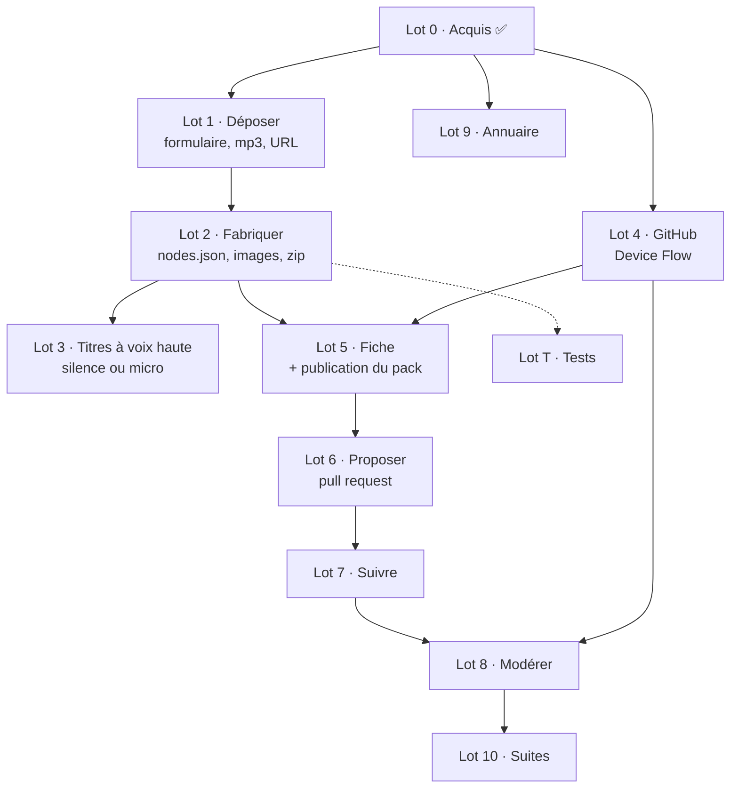

# Découpage du projet

Ce document dit **quoi faire, dans quel ordre, et comment savoir que c'est fini.**
L'objectif est dans [README.md](README.md), l'architecture cible dans
[docs/archi.md](docs/archi.md), et le format à produire — relevé sur un pack réel — dans
[docs/format-pack.md](docs/format-pack.md).

Chaque lot porte un critère d'acceptation vérifiable. Quand c'est possible, ce critère
s'appuie sur le validateur déjà écrit et testé dans
[telmi-store-dev](https://github.com/famaridon/telmi-store-dev) : inutile d'inventer un
juge, on en a un.

Tailles : **S** une soirée · **M** un week-end · **L** plusieurs sessions.

## Le parti pris

**On part d'un écran, pas du disque.** Un contributeur qui a un mp3 ne doit pas avoir à
installer Telmi-Sync, importer, fabriquer, puis publier. Il remplit un formulaire, dépose
ses fichiers, et c'est tout : **Telmi Store fabrique le pack lui-même.**

Conséquence : pour contribuer, **Telmi-Sync n'est plus nécessaire.** C'est la différence
entre une contribution qui demande une chaîne d'outils et une contribution qui demande un
après-midi.

**On ne fabrique que des packs « liste audio »** — un mp3 seul, ou plusieurs chapitres.
Les histoires interactives, avec leurs graphes de centaines de nœuds, restent le métier du
Studio de Telmi-Sync.

---

## Lot 0 — Acquis ✅

Coquille Electron + React + TypeScript, trois cibles typées. Renderer isolé, CSP. Contrat
d'IPC unique où tout canal renvoie un `Result<T>`.

**Architecture en couches**, dépendances vers l'intérieur, avec quatre ports et une racine
de composition. La règle est vérifiée par `tests/architecture.test.ts`, qui échoue sur une
dépendance interdite, une fabrique appelée hors racine, ou une phrase française hors de
`renderer/`. Voir [docs/archi.md](docs/archi.md), section 2.

Lecture en seule lecture de `~/.telmi/stories`. **Ce n'est plus le chemin principal** : ça
devient une voie secondaire, « proposer une histoire déjà fabriquée », utile à qui a déjà
des packs — et l'écran qui rend visible le bug des `version: 0`.

---

## Lot 1 — Déposer : l'écran d'entrée ✅

**Livré.** Dépend de : rien. C'est la porte d'entrée de tout le projet.

Un seul écran, qui doit être franchissable par un parent ou une institutrice.

- [x] **Un mp3 seul** ou **plusieurs chapitres**, au choix, sans que le second cas
      complique le premier
- [x] Chaque chapitre vient d'un **fichier local** (glisser-déposer ou sélecteur) **ou
      d'une URL**
- [x] Réordonner les chapitres, en renommer un, en retirer un
- [x] Afficher la durée de chaque chapitre et le poids total — la durée vient
      gratuitement d'un élément `<audio>`, il n'y a rien à décoder
- [x] Champs du pack : titre, âge, catégorie, langue, description, **question du menu**
      (« Quelle histoire veux-tu écouter ? »)
- [x] Couverture obligatoire : fichier ou URL
- [x] Image par chapitre, facultative — à défaut, la couverture
- [x] Bloc **droits** obligatoire : statut, source, déclarant
- [x] Aperçu avant fabrication : la liste des chapitres avec leurs durées et le poids total

**Critère d'acceptation.** Depuis un dossier de mp3 quelconque, on remplit l'écran et on
arrive au bout sans jamais ouvrir un terminal ni un éditeur de texte.

⏳ **Reste un essai humain**, seul point ouvert de ce lot : le glisser-déposer, les aperçus
et le confort général ne se testent pas sans souris. `npm run dev`, puis glisser plusieurs
mp3, écouter une piste et se déplacer dedans, coller une URL, et regarder ce que dit le
récapitulatif quand il manque des choses.

En prime, le contributeur peut **écouter chaque piste dans l'écran** avant de proposer —
ce qui est la moitié du travail de curation.

**Points d'attention.**
- Le téléchargement d'une URL se fait dans le processus principal, pas dans le renderer :
  ni CORS ni jeton à exposer.
- Une URL peut être longue à répondre ou mentir sur son type. Message clair, jamais un
  compteur qui tourne.
- **On ne valide pas et on ne convertit pas l'audio.** Ce n'est pas notre métier :
  Telmi-Sync a une commande « optimiser l'audio » pour ça. On recopie le mp3 tel quel.
- **Le poids total conditionne tout le reste** : au-delà de 2 Gio, aucun asset de release
  ne l'acceptera. À afficher tôt, pas à la fin.

**Deuxième itération, à ne pas engager d'emblée.** Coller l'**URL d'un flux RSS** et
laisser l'application proposer les épisodes à cocher. C'est le geste le plus naturel pour
un podcast, et c'est ce qui a produit les stores existants — mais ça double le lot.

---

## Lot 2 — Fabriquer le pack ✅

**Livré.** Dépend de : lot 1. C'est le cœur technique.

Produire l'arborescence décrite dans [docs/format-pack.md](docs/format-pack.md), à
l'octet près.

- [x] Générer `nodes.json` pour N chapitres — le graphe est entièrement mécanique, y
      compris le bouclage du dernier chapitre sur l'index 0
- [x] Générer `metadata.json` avec **`version` ≥ 1** et un `uuid` stable, et `notes.json`
- [x] Générer les images : `cover.png` 512 × 512, `title.png` et `images/m<n>.png`
      640 × 480, titre incrusté
- [x] Recopier les audios des chapitres en `audios/s<n>.mp3`
- [x] Zipper, calculer `sha256` et `taille`

**Critère d'acceptation ✅.** Un pack produit par l'application a été passé au validateur,
installation comprise :

```
5. FORMAT_TELMI detecte  — dossier « (racine) », les 4 marqueurs presents
6. histoire installee    — Store Dev_03_Pack de validation lot 2_fffffc-lot2-validation
   Bilan  10 OK · 0 avertissement · 0 KO
```

Le nom du dossier installé conserve notre `uuid` : c'est précisément ce qui fera
fonctionner la détection de mise à jour.

⏳ **Reste à écouter un pack sur une vraie conteuse** — seul juge du format audio et du
câblage de `nodes.json`. Le graphe est couvert par les tests, mais un test ne dit pas si
le bouton HOME tombe où l'enfant l'attend.

**Décision structurante : aucun binaire externe.** Tout est faisable en JavaScript pur et
avec les API de Chromium, ce qui évite de télécharger ffmpeg comme le fait Telmi-Sync :

| Besoin | Moyen | Dépendance |
| --- | --- | --- |
| Générer les images avec du texte | `<canvas>` puis `toBlob('image/png')` | aucune |
| Créer un mp3 court (titres dits à voix haute) | `lamejs` | pure JS, ~100 Ko |
| Zipper | `yazl` | pure JS, streaming |
| Recopier les mp3 des chapitres | `fs`, sans les ouvrir | aucune |

**Tenu :** aucun binaire externe n'est nécessaire pour fabriquer un pack. Le seul octet
d'audio que l'application produit elle-même est un silence de 1 820 octets, figé dans le
code, qui tient la place du marqueur `title.mp3` en attendant une voix.

Le renderer génère les images sur un canvas — le contributeur **voit** ce qu'il va
publier — et envoie les octets au processus principal. Les mp3 des chapitres sont recopiés
sans ré-encodage : c'est le gros du poids, et le format de référence montre que le débit
n'est pas contraint.

**Points d'attention.**
- `ConvertZip.js` exige *exactement quatre* fichiers marqueurs. Un pack qui en manque un
  est rejeté sans explication : la fabrication doit les garantir.
- **Pourquoi fabriquer, alors que livrer un dossier brut au `FORMAT_AUDIO_LIST` ferait
  faire tout le travail à Telmi-Sync ?** Parce que cet import régénère un `uuid` et remet
  `version` à 0 à chaque fois : l'histoire resterait affichée comme téléchargeable même
  après installation, et aucune mise à jour ne serait jamais détectable. C'est le mécanisme
  sur lequel repose tout le modèle de store. Le raisonnement complet est dans
  [docs/format-pack.md](docs/format-pack.md), section « Quel format livrer ».
- Un pack livré au format Telmi n'est converti **à aucun moment** : `fs.copyFileSync` à
  l'import comme au transfert vers la carte. Ce qu'on met dedans arrive tel quel.

---

## Lot 3 — Les titres dits à voix haute ✅

**Livré : le silence comme filet, le micro comme chemin conseillé.** Piper reste au lot 10.

Le format prévoit `title.mp3`, `q.mp3` et un `m<n>.mp3` par chapitre : le titre du pack,
la question, et le titre de chaque chapitre, dits à voix haute. C'est ce qui rend la
conteuse utilisable par un enfant **qui ne lit pas encore** — et la cible affichée des
sources collectées est le Cycle 1, donc 3 à 6 ans.

Trois voies, à trancher :

| Voie | Coût | Ce que ça donne |
| --- | --- | --- |
| **Silence** — `audio: null` sur les `m<n>`, pas de `q.mp3` | nul | valide, mais l'enfant doit lire l'image. Mauvais pour la cible |
| **Micro** — le contributeur dit les titres dans l'application | faible : `MediaRecorder` + `lamejs`, aucun binaire | la voix d'un parent. Plus chaleureux que n'importe quelle synthèse |
| **Piper** — la même synthèse que Telmi-Sync | fort : télécharger binaire et voix (~50 à 80 Mo) | homogène avec les packs officiels, automatisable |

**Retenu : le silence comme filet, le micro comme chemin conseillé.** Aucun binaire dans
les deux cas. Dire quatre titres au micro prend deux minutes, et une voix de parent vaut
mieux qu'une synthèse pour un enfant de trois ans.

- [x] Enregistrement au micro, une étiquette à la fois, avec minuterie et arrêt à 15 s
- [x] Réécoute et reprise de chaque enregistrement
- [x] Conversion WebM/Opus → mp3 en JavaScript pur, sans binaire
- [x] Repli sur le silence pour toute étiquette non enregistrée
- [x] Permission micro accordée côté Electron, et `NSMicrophoneUsageDescription` pour macOS

**Règle retenue : tout ou rien pour le menu.** Un menu qui parle une fois sur deux est pire
qu'un menu muet — l'enfant entend une voix, puis rien, et ne peut pas comprendre pourquoi.
La conteuse n'annonce donc les titres que si **tous** sont enregistrés. `title.mp3` fait
exception : c'est un marqueur, il est utilisé dès qu'il existe.

⏳ **Critère d'acceptation restant** : entendre les titres au bon moment sur une vraie
conteuse. Le format produit a été vérifié contre ffmpeg — 44 100 Hz stéréo 128 kb/s, le
format de référence exactement — mais seul le matériel dira si l'annonce tombe juste.

---

## Lot 4 — Connexion GitHub par Device Flow ✅

**Livré.** Dépend de : rien.

- [x] `POST /login/device/code`, puis attente selon l'`interval` renvoyé
- [x] Traiter `authorization_pending`, `slow_down`, `expired_token`, `access_denied` —
      chacun avec son message
- [x] Stocker le jeton avec `safeStorage`, hors du renderer
- [x] Écran : le code à saisir en gros, cliquable pour le copier, un bouton qui ouvre
      `github.com/login/device`, et l'état
- [x] **Onboarding** : quand personne n'est connecté, l'application ouvre sur une page qui
      dit ce qu'elle fait, répond à « pourquoi un compte GitHub ? », et propose la
      connexion — avec une échappatoire « découvrir sans compte », puisqu'une histoire peut
      se préparer sans compte et que seule la publication en demande un
- [x] Annuler une connexion en cours
- [x] Se déconnecter et effacer le jeton
- [x] Refuser un jeton sans la portée nécessaire, plutôt que de le découvrir en pleine
      publication
- [x] Oublier un jeton que GitHub n'honore plus, plutôt qu'échouer à chaque démarrage

**Critère d'acceptation.** Se connecter, fermer l'application, la relancer : on est
toujours connecté, le nom du compte s'affiche, et aucun jeton n'est en clair sur le disque.

**Points d'attention tenus.** Portée `public_repo`, rien de plus. Le jeton ne traverse
jamais l'IPC : l'interface apprend *qui* est connecté, jamais *avec quoi*. L'avatar GitHub
a été retiré du modèle, parce que l'afficher aurait obligé à ouvrir la CSP sur
`avatars.githubusercontent.com` — le renderer ne charge rien depuis le réseau.

✅ **OAuth App créée et vérifiée.** `Ov23likVrp9mwsOFlqtu`, Device Flow actif, commitée
dans `src/infrastructure/config.ts` — un `client_id` identifie une application, il ne
l'authentifie pas, et aucun secret client n'intervient dans ce flux.

Les deux premiers échanges ont été validés contre l'API réelle : la demande de code répond
`interval: 5` et `expires_in: 899`, exactement ce que suppose `planNextPoll`, et le
sondage répond `authorization_pending` sous la forme que parse l'adaptateur.

⏳ **Reste un essai humain** : cliquer, saisir le code sur GitHub, autoriser — seule
l'approbation dans un navigateur ne peut pas être automatisée.

Pour pointer une compilation vers une autre OAuth App — un fork, ou une application de
test — la variable d'environnement reste disponible :

```sh
TELMI_STORE_GITHUB_CLIENT_ID=Ov23li… npm run dev
```

---

## Lot 5 — Fiche et publication du pack

**Taille : M.** Dépend de : lots 2 et 4.

- [ ] Construire la fiche depuis le formulaire, avec `sha256`, `taille`, `uuid`, `version`
- [ ] Générer le `slug` et vérifier qu'il est libre dans le store visé
- [ ] Créer le dépôt d'accueil chez le contributeur, ou réutiliser l'existant
- [ ] Créer la release taguée `<slug>-<version>`, jamais `latest`
- [ ] Envoyer l'asset avec une barre de progression
- [ ] Vérifier après envoi que l'URL publique répond et que le `sha256` correspond

**Critère d'acceptation.** La fiche est acceptée par `outils/verifier-fiches.mjs` du dépôt
de store sans retouche, et le pack est téléchargeable par une URL publique dont
l'empreinte correspond.

**Points d'attention.** **Idempotence** : relancer une publication interrompue ne doit
créer ni second dépôt ni release en double. Un asset de plusieurs centaines de mégaoctets
prend plusieurs minutes sur une ligne domestique : l'échec doit être lisible et l'état
récupérable.

---

## Lot 6 — Proposer : la pull request

**Taille : M.** Dépend de : lot 5.

- [ ] `POST /repos/{store}/forks`, en attendant que le fork réponde réellement
- [ ] Réutiliser et resynchroniser un fork existant
- [ ] `POST /git/blobs` pour la fiche et la vignette
- [ ] `POST /git/trees` → `/git/commits` → `PATCH /git/refs/heads/<branche>`
- [ ] `POST /repos/{store}/pulls`, avec un corps qui reprend la fiche en clair

**Critère d'acceptation.** Une pull request apparaît sur `telmi-store-dev` avec exactement
deux fichiers ajoutés, et l'Action de validation passe au vert dessus.

**Points d'attention.** Le fork est **asynchrone** chez GitHub : créer un blob juste après
échoue parfois. Une branche par proposition, nommée d'après le `slug`.

**C'est ici le premier jalon démontrable.** À la fin de ce lot, une proposition part
réellement : c'est le moment d'en parler à DantSu, avec une vraie PR sur un vrai store
plutôt qu'un plan.

---

## Lot 7 — Suivre sa proposition

**Taille : S.** Dépend de : lot 6.

- [ ] Lister les pull requests ouvertes par l'utilisateur sur les stores connus
- [ ] Afficher l'état — en relecture, acceptée, refusée — avec les commentaires reçus
- [ ] Rouvrir le formulaire pour corriger et repousser sur la même branche

**Critère d'acceptation.** Refuser une PR de test avec un commentaire : l'application
l'affiche comme refusée et montre le commentaire, sans que l'utilisateur ouvre GitHub.

---

## Lot 8 — Modérer

**Taille : L.** Dépend de : lots 4 et 7. C'est le lot qui porte la valeur.

- [ ] Lister les propositions ouvertes du store, si l'utilisateur y a les droits
- [ ] Afficher la fiche proprement, droits en évidence
- [ ] **Écouter** : télécharger le pack, vérifier l'empreinte, le lire dans l'application
- [ ] **Accepter** : fusionner — l'Action régénère l'index
- [ ] **Refuser** : fermer avec un commentaire — geste de premier plan, pas une porte de
      sortie. Proposer des motifs fréquents pour qu'un refus argumenté coûte trois clics

**Critère d'acceptation.** Boucle complète sur `telmi-store-dev` : proposition envoyée
depuis un compte, écoutée puis acceptée depuis l'autre, et l'histoire apparaît dans
Telmi-Sync après rafraîchissement du store. Puis la même boucle avec un **refus argumenté**,
qui doit être aussi rapide qu'une acceptation.

**Ce lot porte l'objectif du projet.** Un store se juge sur ce qu'il a refusé autant que
sur ce qu'il publie : voir « Dix histoires plutôt que cinq cents » dans le README.

**Décision ouverte.** Installer dans `~/.telmi` pour écouter violerait la règle de
non-écriture et polluerait la bibliothèque du modérateur avec des propositions qu'il
refuse. Recommandation : un lecteur intégré, réduit au minimum — décompresser en dossier
temporaire et jouer les audios dans l'ordre de `nodes.json`. Le lot 2 aura de toute façon
appris à lire ce fichier.

---

## Lot 9 — Annuaire de stores

**Taille : S.** Dépend de : rien. Utile dès le lot 6.

- [ ] Charger un `stores.json` distant : nom, langue, description, URL, dépôt
- [ ] Écran « Découvrir », ajout en un clic, mémorisation des choix

**Critère d'acceptation.** Ajouter une entrée dans l'annuaire distant, sans publier de
nouvelle version de l'application : elle apparaît au démarrage suivant.

**Pourquoi ça compte.** Les stores anglais et chinois existent depuis un an et **aucun
utilisateur ne les a jamais vus**, parce qu'il faut fouiller le wiki pour trouver leur URL.
Un store invisible ne reçoit pas de contribution.

---

## Lot 10 — Durcissement et suites

**Taille : variable.** À n'engager qu'une fois la boucle en service.

- [ ] Reprise sur erreur pour les envois d'assets volumineux
- [ ] **Piper** pour la synthèse des titres, quand le micro ne suffit plus
- [ ] Import d'un flux RSS complet (la deuxième itération du lot 1)
- [ ] Enchaîner collecte et dépôt : importer un lot d'audios déjà récupérés par ailleurs
      et en faire plusieurs propositions d'affilée
- [ ] **Proposer à Telmi-Sync** la vérification de l'empreinte au téléchargement — le seul
      point du plan qui demande une modification chez DantSu
- [ ] **Proposer à Telmi-Sync** l'encodage `pal8` des images d'étape : un drapeau ffmpeg,
      5,1 × sur 76 % du poids d'un pack interactif

---

## Lot T — Tests 🟡

**Mise en place faite, 56 tests.** À poursuivre au fil des lots.

- [x] Vitest, un script `npm test`
- [x] Règles du domaine : `reviewSubmission` (ce qui bloque, ce qui avertit, les totaux),
      `titleFromFilename`, extensions et types MIME, nom d'un téléchargement
- [x] Adaptateur réseau contre un coffre en mémoire : succès, progression, et chaque mode
      d'échec nommé
- [x] Barrière d'architecture : imports interdits, racine de composition, langue
- [ ] À venir avec le lot 2 : génération de `nodes.json` pour 1, 2 et N chapitres,
      bouclage du dernier chapitre, présence des quatre marqueurs, empreinte, slug
- [ ] Ne pas bouchonner les appels GitHub : les valider contre `telmi-store-dev`

La génération de `nodes.json` est la fonction la plus testable du projet et celle dont
tout dépend : un graphe mal câblé donne un pack qui s'installe et ne fonctionne pas.

---

## Dépendances



## Ordre conseillé

1. **Lot 1**, puis **lot 2 avec le lot T**. À la fin, un pack fabriqué depuis un
   formulaire s'installe dans Telmi-Sync. C'est le jalon le plus important du projet :
   il prouve que la porte d'entrée fonctionne.
2. **Lot 3** dans sa version silence, puis micro.
3. **Lot 4**, indépendant.
4. **Lot 5**, puis **6** : une proposition part réellement. Premier jalon montrable.
5. **Lot 9** quand on veut, il est court et isolé.
6. **Lot 7**, puis **8** : la modération ferme la boucle.
7. **Lot 10** ensuite, et seulement si quelqu'un s'en sert.

## Prérequis hors code

| Quoi | Pourquoi | Quand |
| --- | --- | --- |
| **Une conteuse Telmi à portée de main** | seul juge du format audio et du câblage de `nodes.json` | dès le lot 2 |
| **Créer une OAuth App GitHub** | le `client_id` du Device Flow. Aucun secret client n'est nécessaire pour ce flux | avant le lot 4 |
| **Un second compte GitHub** | tester la boucle : proposer depuis l'un, modérer depuis l'autre | avant le lot 8 |
| **Store de test** | déjà fait : [telmi-store-dev](https://github.com/famaridon/telmi-store-dev) | ✅ |
| **Décider du nom public du store** | `telmi-store-fr` est déjà pris par une organisation vide de DantSu | avant d'ouvrir aux contributions |

## Décisions ouvertes

**1. Les titres dits à voix haute** *(lot 3)* — silence, micro ou Piper. Recommandation :
silence comme filet, micro comme chemin conseillé, Piper plus tard.

**2. Tranchée : on ne touche pas à l'audio.** Le mp3 du contributeur est recopié tel quel.
Telmi-Sync ne le convertit ni à l'import d'un pack Telmi ni au transfert vers la carte,
donc il arrive intact sur la conteuse — et si un fichier posait problème, l'utilisateur a
la commande « optimiser l'audio ». Reste à vérifier une fois sur matériel, sans en faire
un préalable.

**3. Comment écouter en modération ?** *(lot 8)* — lecteur intégré recommandé, plutôt
qu'une installation dans `~/.telmi`.

**4. Où stocker le jeton ?** *(lot 4)* — `safeStorage` suffit ; à confirmer sous Linux, où
il peut retomber sur un chiffrement faible selon l'environnement de bureau.

**5. Un store ou plusieurs ?** *(lot 9)* — un par langue comme aujourd'hui, ou un store
unique multilingue ? Le champ `langue` existe déjà dans la fiche, donc les deux sont
possibles sans rien changer.

## Ce qu'on ne fait pas

- Fabriquer des histoires **interactives**. Trop complexe pour l'instant, et c'est le
  métier du Studio de Telmi-Sync.
- Héberger des packs, servir des fichiers, faire tourner un serveur.
- Écrire dans `~/.telmi`, jamais, pour aucune raison.
- Parler à la conteuse ou à la carte SD : ça reste à Telmi-Sync.
- Un site web. L'annuaire est un fichier JSON, pas une plateforme.
