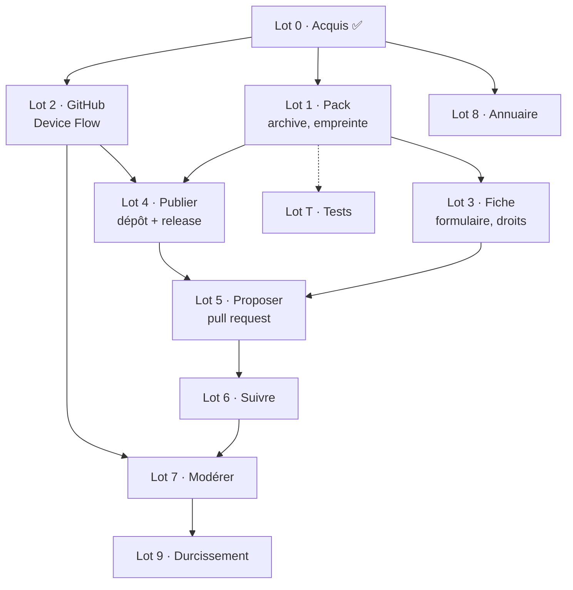

# Découpage du projet

Ce document dit **quoi faire, dans quel ordre, et comment savoir que c'est fini.**
L'architecture cible est dans [docs/archi.md](docs/archi.md) ; l'objectif dans
[README.md](README.md).

Chaque lot porte un critère d'acceptation vérifiable. Quand c'est possible, ce critère
s'appuie sur le validateur déjà écrit et testé dans
[telmi-store-dev](https://github.com/famaridon/telmi-store-dev) — inutile d'inventer un
juge, on en a un.

Tailles : **S** une soirée · **M** un week-end · **L** plusieurs sessions.

---

## Lot 0 — Acquis ✅

Coquille Electron + React + TypeScript, trois cibles typées. Renderer isolé, CSP.
Contrat d'IPC unique où tout canal renvoie un `Resultat<T>`. Lecture en seule lecture de
`~/.telmi/stories` avec signalement des histoires en `version: 0`.

---

## Lot 1 — Pack : archive, empreinte, correction du `metadata.json`

**Taille : M.** Prérequis de tout le reste, aucune dépendance.

Fabriquer, depuis un dossier de `~/.telmi/stories`, un zip publiable, et en connaître
l'empreinte.

- [ ] Zipper un dossier d'histoire en conservant les quatre fichiers marqueurs
      (`metadata.json`, `nodes.json`, `title.mp3`, `title.png`) dans un même dossier
- [ ] Calculer `sha256` et `taille` du zip produit
- [ ] **Corriger `version` à la volée dans le `metadata.json` de l'archive** quand elle
      vaut 0 ou est absente, sans jamais toucher au fichier d'origine
- [ ] Afficher le poids du pack et prévenir quand il dépasse 2 Gio (limite d'un asset)

**Critère d'acceptation.** Le zip produit passe le validateur :
```sh
TELMI_SYNC=../Telmi-Sync node ../telmi-store-dev/outils/valider-store.mjs <url> --installer
```
avec un `FORMAT_TELMI detecte` et une installation réussie.

**Points d'attention.**
- Node n'a pas de zip natif. Une dépendance est nécessaire — `yazl` (minimal, streaming)
  plutôt qu'`archiver` (beaucoup plus gros pour ce qu'on en fait).
- La correction du `metadata.json` résout proprement le bug des dix histoires du store
  officiel bloquées en `version: 0` : la règle « ne jamais écrire dans `~/.telmi` » est
  respectée puisqu'on ne modifie que l'archive, et l'`uuid`/`version` de la fiche reste
  cohérent avec le pack livré. **C'est la bonne place pour ce correctif.**
- `ConvertZip.js` exige *exactement* quatre marqueurs : une histoire qui en manque un doit
  être refusée avec un message qui dit lequel.

---

## Lot 2 — Connexion GitHub par Device Flow

**Taille : M.** Dépend de : rien. Peut être mené en parallèle du lot 1.

- [ ] `POST /login/device/code`, puis attente active selon l'`interval` renvoyé
- [ ] Traiter les quatre réponses d'attente : `authorization_pending`, `slow_down`,
      `expired_token`, `access_denied` — chacune avec son message
- [ ] Stocker le jeton avec `safeStorage` d'Electron, hors du renderer
- [ ] Écran : le code à saisir, un bouton qui ouvre `github.com/login/device`, l'état
- [ ] Se déconnecter, et effacer le jeton

**Critère d'acceptation.** Se connecter, fermer l'application, la relancer : on est
toujours connecté et le nom du compte s'affiche. Aucun jeton en clair sur le disque.

**Points d'attention.**
- **Prérequis humain** : créer une OAuth App GitHub pour obtenir un `client_id`. Voir
  « Prérequis hors code » plus bas.
- Portée `public_repo`, rien de plus. Le refuser explicitement si GitHub en accorde moins.
- Le jeton ne doit jamais transiter par l'IPC vers le renderer, même pour affichage.

---

## Lot 3 — Fiche : formulaire, droits, validation

**Taille : S.** Dépend de : lot 1 (pour `sha256` et `taille`).

- [ ] Formulaire : titre, âge, catégorie, langue, description
- [ ] Bloc droits : statut parmi les cinq valeurs, source, déclarant — **obligatoire**
- [ ] Générer le `slug` depuis le titre, et vérifier qu'il est libre dans le store visé
- [ ] Valider côté application avec les mêmes règles que `verifier-fiches.mjs`
- [ ] Aperçu de la fiche JSON avant envoi

**Critère d'acceptation.** La fiche produite est acceptée par
`node outils/verifier-fiches.mjs` du dépôt de store, sans retouche manuelle.

**Points d'attention.** La déclaration de droits est le seul garde-fou avant la modération
humaine : elle ne doit pas pouvoir être contournée, ni pré-remplie par défaut sur une
valeur permissive.

---

## Lot 4 — Publier le pack chez le contributeur

**Taille : M.** Dépend de : lots 1 et 2.

- [ ] Créer le dépôt d'accueil (`POST /user/repos`), ou réutiliser celui qui existe
- [ ] Créer la release taguée `<slug>-<version>`, jamais `latest`
- [ ] Envoyer l'asset, avec une barre de progression
- [ ] Vérifier après envoi que l'URL publique répond et que le `sha256` correspond

**Critère d'acceptation.** Le pack est téléchargeable par une URL publique, et le
`sha256` téléchargé est identique à celui de la fiche.

**Points d'attention.**
- **Idempotence.** Relancer une publication qui a échoué à mi-chemin ne doit pas créer un
  second dépôt ni une release en double.
- Un asset de 183 Mo sur une connexion domestique, c'est plusieurs minutes : la reprise
  sur erreur peut attendre le lot 9, mais l'échec doit être clair et l'état récupérable.

---

## Lot 5 — Proposer : la pull request

**Taille : M.** Dépend de : lots 3 et 4.

- [ ] `POST /repos/{store}/forks`, en attendant que le fork soit réellement prêt
- [ ] Réutiliser et resynchroniser un fork déjà existant
- [ ] `POST /git/blobs` pour la fiche et la vignette
- [ ] `POST /git/trees` → `/git/commits` → `PATCH /git/refs/heads/<branche>`
- [ ] `POST /repos/{store}/pulls`, avec un corps qui reprend la fiche en clair

**Critère d'acceptation.** Une pull request apparaît sur `telmi-store-dev` avec exactement
deux fichiers ajoutés, et l'Action de validation passe au vert dessus.

**Points d'attention.**
- Le fork est **asynchrone** chez GitHub : créer un blob juste après échoue parfois. Il
  faut attendre que le dépôt réponde avant de continuer.
- Une branche par proposition, nommée d'après le `slug`, pour permettre plusieurs
  propositions simultanées.

---

## Lot 6 — Suivre sa proposition

**Taille : S.** Dépend de : lot 5.

- [ ] Lister les pull requests ouvertes par l'utilisateur sur les stores connus
- [ ] Afficher l'état : en relecture, acceptée, refusée — avec les commentaires reçus
- [ ] Rouvrir le formulaire pour corriger et repousser sur la même branche

**Critère d'acceptation.** Refuser une PR de test avec un commentaire : l'application
l'affiche comme refusée et montre le commentaire, sans que l'utilisateur ouvre GitHub.

---

## Lot 7 — Modérer

**Taille : L.** Dépend de : lots 2 et 6. C'est le lot qui porte la valeur.

- [ ] Lister les propositions ouvertes du store, si l'utilisateur y a les droits
- [ ] Afficher la fiche proprement, droits en évidence
- [ ] **Écouter** : télécharger le pack, vérifier son empreinte, le lire dans
      l'application
- [ ] **Accepter** : fusionner la PR — l'Action régénère l'index
- [ ] **Refuser** : fermer avec un commentaire

**Critère d'acceptation.** Boucle complète sur `telmi-store-dev` : une proposition envoyée
depuis un compte, écoutée puis acceptée depuis l'autre, et l'histoire apparaît dans
Telmi-Sync après rafraîchissement du store.

**Décision ouverte — voir plus bas.** Écouter en installant dans `~/.telmi` violerait la
règle de non-écriture. La recommandation est un lecteur intégré, qui décompresse dans un
dossier temporaire et joue les audios dans l'ordre de `nodes.json`. C'est plus de travail,
mais un modérateur ne veut pas voir sa bibliothèque polluée par des propositions qu'il
refuse.

---

## Lot 8 — Annuaire de stores

**Taille : S.** Dépend de : rien de fonctionnel, utile dès le lot 5.

- [ ] Charger un `stores.json` distant : nom, langue, description, URL, dépôt
- [ ] Écran « Découvrir » avec ajout en un clic
- [ ] Mémoriser les stores choisis

**Critère d'acceptation.** Ajouter une entrée dans l'annuaire distant, sans publier de
nouvelle version de l'application : elle apparaît au démarrage suivant.

**Pourquoi ça compte.** Les stores anglais et chinois existent depuis un an et **aucun
utilisateur ne les a jamais vus**, parce qu'il faut fouiller le wiki pour trouver leur
URL. Un store invisible ne reçoit pas de contribution.

---

## Lot 9 — Durcissement et suites

**Taille : variable.** À n'engager qu'une fois la boucle complète en service.

- [ ] Reprise sur erreur pour les envois d'assets volumineux
- [ ] Absorber le collecteur `telmi-collecte.py` : collecter, fabriquer, proposer d'un
      seul geste
- [ ] **Proposer à Telmi-Sync** la vérification de l'empreinte au téléchargement — le seul
      point de tout le plan qui demande une modification chez DantSu
- [ ] **Proposer à Telmi-Sync** l'encodage `pal8` des images d'étape : un seul drapeau
      ffmpeg, 5,1 × sur 76 % du poids d'un pack, sans changer de format

---

## Lot T — Tests

**Taille : S** pour la mise en place, puis continu.

- [ ] Installer Vitest, un script `npm test`
- [ ] Couvrir la logique pure : validation de fiche, calcul d'empreinte, génération de
      slug, correction du `metadata.json`, lecture de `nodes.json`
- [ ] Ne pas chercher à couvrir les appels GitHub par des bouchons : les valider contre
      `telmi-store-dev`, qui est fait pour ça

À faire pendant le lot 1, pas après : la logique du lot 1 est la plus testable de tout
le projet, et c'est celle dont tout le reste dépend.

---

## Dépendances



## Ordre conseillé

1. **Lot 1 + Lot T ensemble.** Le pack est le socle, et c'est la partie testable.
2. **Lot 2.** Indépendant, donc bon candidat si l'envie est ailleurs un soir.
3. **Lot 3, puis 4, puis 5.** À la fin du lot 5, une proposition part réellement : c'est
   le premier jalon qui se montre.
4. **Lot 8** quand on veut, il est court et isolé.
5. **Lot 6, puis 7.** La modération ferme la boucle.
6. **Lot 9** ensuite, et seulement si quelqu'un s'en sert.

Le premier jalon démontrable est donc **la fin du lot 5**. C'est le moment d'en parler à
DantSu, avec une vraie proposition ouverte sur un vrai store.

## Prérequis hors code

| Quoi | Pourquoi | Quand |
| --- | --- | --- |
| **Créer une OAuth App GitHub** | obtenir le `client_id` du Device Flow. Aucun secret client n'est nécessaire pour ce flux, le `client_id` peut être embarqué dans l'application | avant le lot 2 |
| **Un second compte GitHub** | tester la boucle complète : proposer depuis un compte, modérer depuis l'autre | avant le lot 7 |
| **Store de test** | déjà fait : [telmi-store-dev](https://github.com/famaridon/telmi-store-dev) | ✅ |
| **Décider du nom public du store** | `telmi-store-fr` est déjà pris par une organisation vide de DantSu | avant d'ouvrir aux contributions |

## Décisions ouvertes

**1. Comment écouter un pack en modération ?** *(bloquant pour le lot 7)*
Installer dans `~/.telmi` est simple mais viole la règle de non-écriture et pollue la
bibliothèque du modérateur avec des propositions refusées. Un lecteur intégré est plus
propre et plus agréable, mais c'est un vrai morceau. **Recommandation : lecteur intégré**,
en commençant par le strict minimum — décompresser dans un dossier temporaire et jouer les
audios dans l'ordre de `nodes.json`, sans images ni navigation.

**2. Où stocker le jeton ?** *(lot 2)*
`safeStorage` d'Electron s'appuie sur le trousseau du système et suffit. À confirmer que
le comportement est acceptable sur Linux, où `safeStorage` peut retomber sur un chiffrement
faible selon l'environnement de bureau.

**3. Un store ou plusieurs ?** *(lot 8)*
Un store par langue, comme aujourd'hui, ou un store unique multilingue avec un champ
`langue` par fiche ? Le champ existe déjà dans la fiche, donc le second est possible sans
rien changer. Un store unique concentre l'audience et la modération ; plusieurs stores
répartissent la charge et permettent des mainteneurs par langue.

**4. Faut-il un mode « store privé » ?** *(après le lot 8)*
Le serveur HTTP local de Telmi-Sync sert déjà `{banner, data[]}` sur son port : partager
sa bibliothèque sur un réseau local fonctionne déjà, sans rien de tout ce projet. Vaut-il
la peine d'en faire une fonction visible, ou est-ce hors sujet ?

## Ce qu'on ne fait pas

- Héberger des packs, servir des fichiers, faire tourner un serveur.
- Fabriquer une histoire de zéro : c'est le métier du Studio de Telmi-Sync.
- Écrire dans `~/.telmi`, jamais, pour aucune raison.
- Parler à la conteuse ou à la carte SD.
- Un site web. L'annuaire est un fichier JSON, pas une plateforme.
